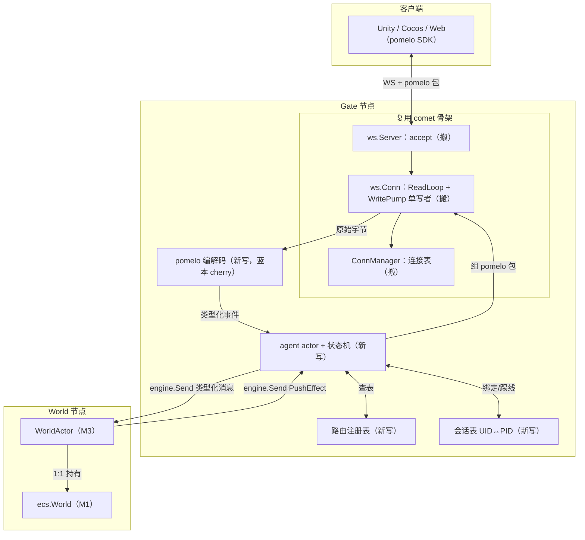
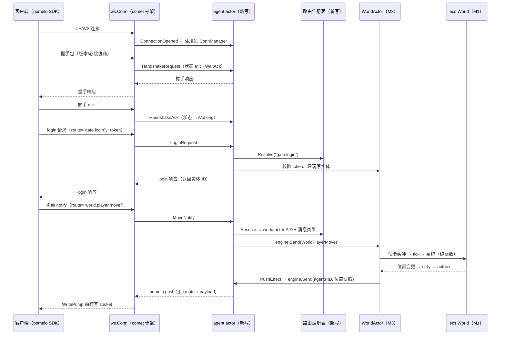
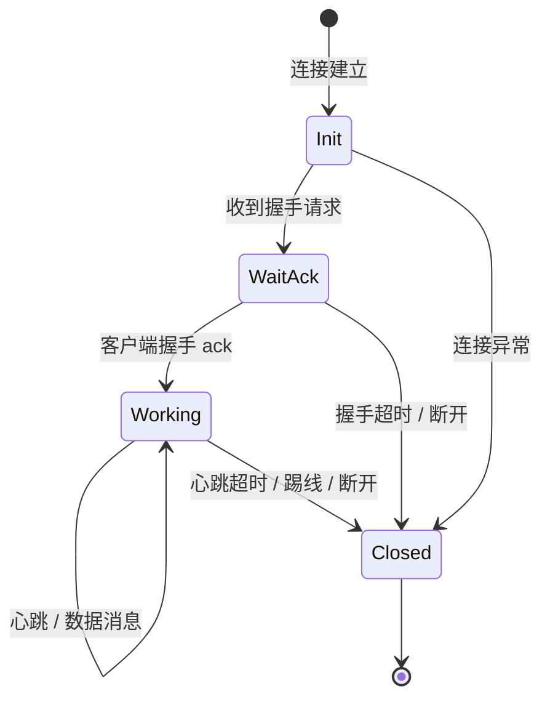

# M4 Gateway 实现设计

> 状态：设计定稿（2026-08-06）
> 目标：用户长连接接入层 + 最小游戏闭环——WS 连接 + pomelo 协议 + agent 模型 + 路由/会话，最终两个客户端连接、登录、移动、互见位置。
> 蓝本：comet 连接层骨架（复用）+ cherry `net/parser/pomelo`（协议参考）+ 设计文档 §6。

## 1. 总体架构

## 2. 端到端消息流

## 3. agent 状态机（每连接一个）

## 4. comet 关键设计与复用

### 4.1 comet 是什么（要点回顾）

feeds 的长连接实时通信模块（`~/feeds/pkg/comet`，核心约 800 行）：

- **分层**：`Server`（协议无关接口）→ `Core`（协议无关 dispatch）→ `Conn`（连接抽象）→ `ConnManager`（连接表）→ `Business`（业务回调）；
- **ws.Conn 读写分离**：`ReadLoop` 独占读、`WritePump` 独占写（send channel 队列）——这是**单写者铁律**的实现，最有复用价值；
- **ConnManager**：线程安全连接注册表 + 房间绑定（roomID=userID）+ 房间广播；
- **Core.Dispatch**：按 2 字节帧头分发（Heartbeat / Auth / Message）；
- **Business 接口**：`OnAuth`（鉴权回调）/ `OnMessage`（业务消息回调）；
- **client.Conn**：客户端连接实现（自动鉴权 + 心跳），可改造成测试客户端。

### 4.2 复用映射

| comet 文件 | 去留 | 落点 |
|---|---|---|
| `ws/conn.go` | ✅ 搬（读写分离 + 单写者写泵） | `internal/gateway/conn.go` |
| `conn_manager.go` | ✅ 搬（连接表 + 广播） | `internal/gateway/conn_manager.go` |
| `ws/server.go` | ✅ 搬（accept + 每连接两 goroutine） | `internal/gateway/ws.go` |
| `protocol.go` | ❌ 换 pomelo 帧 | `internal/gateway/pomelo/` |
| `server.go` Core.Dispatch | ⚠️ 形态保留，分发逻辑换 pomelo | agent 解析入口 |
| `client/conn.go` | 🔁 改造成 pomelo 测试客户端 | `tools/` |

核心观察：**comet 提供"壳"（连接、读写泵、连接表），pomelo 协议、agent 状态机、路由、会话是我们要补的"肉"**。
`ws.Conn` 的 ReadLoop 吐原始字节、WritePump 单写者，正好是 pomelo 包编解码的天然边界。

## 5. 需要做的适配（comet → starve Gateway）

| # | 维度 | comet 现状 | starve 适配 |
|---|------|-----------|-------------|
| 1 | 协议 | 2 字节帧 `[type][payload]` | pomelo packet（type + 3 字节长度）+ message（flag / varint mid / route） |
| 2 | 分发 | Core.Dispatch 按 2 字节类型 | 按 pomelo 消息类型 + route 分发 |
| 3 | 鉴权 | Auth 帧（连接后第一条） | 握手纯净（版本/心跳协商），连接后 `login` 请求校验 token |
| 4 | 状态机 | 无显式状态机 | Init → WaitAck → Working → Closed |
| 5 | 会话 | ConnManager 房间绑定（roomID=userID） | UID ↔ agent PID 会话表 + 同 UID 踢旧 + 断线通知世界 |
| 6 | 路由 | 无 | route 注册表：route → 消息类型 → 目标 PID |
| 7 | 单写者 | 已有（保留） | 保留：所有写出走同一队列，WritePump 串行 |
| 8 | 反序列化 | OnMessage 收裸字节 | 网关按 route 反序列化成类型化消息，世界 actor 收类型化 |

## 6. 分层职责与边界

| 层 | 管什么 | 不管什么 |
|---|---|---|
| 连接层（comet） | accept、读写泵、连接表 | 协议语义 |
| 协议层（pomelo） | packet/message 编解码 | 业务逻辑 |
| agent | 连接状态机、写队列、心跳/踢线 | 模拟、玩家数据 |
| 路由/会话 | route → 消息类型 → PID；UID ↔ PID | 业务逻辑 |
| WorldActor | 模拟、玩家数据、outbox | 连接与协议 |

Gateway 只做"接连接、解协议、管会话、转路由"；不做模拟、不做玩家数据。

## 7. 实施顺序

1. 连接层三件套（搬 comet：ws.Server / ws.Conn / ConnManager）；
2. pomelo 编解码（packet + message + 单测）；
3. agent actor + 状态机；
4. 路由注册表 + 会话表；
5. 登录时序（握手纯净 + login）；
6. 最小闭环（接 M3 WorldActor：移动指令 → tick → 位置广播）；
7. 测试客户端（`tools/`，pomelo 协议）；
8. 验收：两个客户端连接、登录、移动、互见位置。
