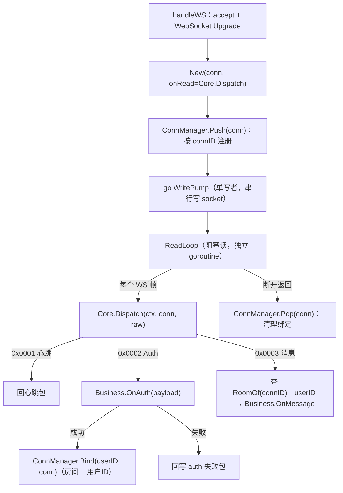

# comet 机制详解（feeds 长连接组件）

> 记录 comet 的连接生命周期、业务握手与连接管理机制，供 starve Gateway 复用与日后整理归纳。
> 源码：`~/feeds/pkg/comet`（ws.Server / ws.Conn / ConnManager / Core / Business，核心约 800 行）。

## 1. 连接生命周期



核心代码（ws/server.go 的 handleWS）：

```go
conn = New(rawWS, func(raw []byte) { s.Core.Dispatch(ctx, conn, raw) }) // 读回调绑到 Dispatch
s.Core.ConnManager().Push(conn)   // 注册进连接表
go conn.WritePump()               // 写泵启动（单写者）
conn.ReadLoop()                   // 阻塞读，断开才返回
s.Core.ConnManager().Pop(conn)    // 退出时清理
```

要点：**accept 后 comet 不自己处理协议**，每个连接的读回调统一接到 `Core.Dispatch`，业务逻辑通过 `Business` 接口回调出去。

## 2. 业务握手（Auth）

comet 的"握手"就是 Auth 帧（0x0002），连接建立后第一条业务消息必须是它：

```go
func (c *Core) handleAuth(ctx, conn, payload) {
    userID, err := c.cfg.Business.OnAuth(ctx, payload)   // 业务层校验 token
    if err != nil || userID == "" {
        conn.Write(ctx, []byte{0x00, 0x00})              // 失败：回 auth 失败包
        return
    }
    c.cfg.ConnManager.Bind(userID, conn)                 // 成功：绑定"房间"= 用户ID
    conn.Write(ctx, []byte{0x00, 0x01})                  // 回 auth 成功包
}
```

绑定语义：**`Bind(userID, conn)` 把连接绑定到一个"房间"，房间 ID 就是用户 ID**——既是鉴权成功标记，又是广播寻址单位（`PushToRoom(userID, data)` 就是给该用户推送）。

## 3. 连接管理（ConnManager）

三张表，全部线程安全（一把 RWMutex）：

| 表 | 键 → 值 | 作用 |
|---|---|---|
| `conns` | connID → Conn | 连接注册表（Push/Pop） |
| `rooms` | roomID → {connID → Conn} | 房间成员表（Bind 后进这里） |
| `connRoom` | connID → roomID | 反查：连接属于哪个房间 |

生命周期：

- **Push**：连接建立（还没有身份）；
- **Bind**：Auth 成功后，进 rooms + connRoom；
- **Pop**：连接断开，三张表一起清（房间没人就删房间）；
- **RoomOf**：消息路径查身份；**PushToRoom**：给房间所有连接广播（先取快照，再逐个 `Write`，写队列满跳过计为未投递）。

## 4. 心跳与消息路径

- 心跳：`handleHeartbeat` 原样回 `HeartbeatReply`（comet 靠客户端定时心跳保活，读超时在 ws.Conn 的 ReadDeadline 上）；
- 消息：`handleMessage` 先 `RoomOf(connID)` 查身份，未绑定拒绝，绑定后调 `Business.OnMessage(ctx, connID, userID, payload)`。

## 5. 与 starve Gateway 的映射

| comet | starve 适配 |
|---|---|
| accept → Push → WritePump → ReadLoop → Pop | ✅ 保留生命周期，ReadLoop 字节交给 pomelo 解析器 |
| Auth 帧 + OnAuth + Bind(userID) | ⚠️ 握手纯净 + `login` 请求；状态机 Init→WaitAck→Working |
| ConnManager 三张表 | ⚠️ 连接表保留，升级为会话表 UID ↔ agent PID |
| PushToRoom 广播 | ✅ 形态保留：会话表/GetPids 查目标，engine.Send 推给 agent |
| OnMessage 回调 | ⚠️ 换成 agent actor Receive + 路由注册表 |

核心差异：**comet 把"连接"当最终推送目标（PushToRoom 直接写 conn），我们把"agent actor"当推送目标**——房间绑定升级成会话表，写连接变成发消息给 agent，由 agent 的写泵出网。

## 6. 附录：MsgScheme 协议可插拔改造（提案）

目标：把 comet 的帧格式抽象成可配置的协议方案，默认保留原 `[2B type][payload]`，pomelo 侧自定义新 scheme。

```go
// comet 侧新增（协议无关）

// MsgType 协议语义消息类型：各 scheme 自行映射线路格式到这些语义类型。
type MsgType uint8

const (
    MsgHandshake    MsgType = iota + 1 // 握手
    MsgHandshakeAck                    // 握手确认
    MsgHeartbeat                       // 心跳
    MsgData                            // 业务数据
    MsgKick                            // 踢线
)

// Msg 是协议无关的内部消息：语义类型 + 纯字节负载。
type Msg struct {
    Type    MsgType
    Payload []byte
}

// MsgScheme 协议编解码方案：Msg ⇄ 线路字节。
type MsgScheme interface {
    Encode(msg *Msg) ([]byte, error) // 写出：消息 → 字节
    Decode(data []byte) (*Msg, error) // 读入：字节 → 消息
}

// ServerConfig 增加 Scheme（nil 时用默认 frameScheme）
type ServerConfig struct {
    Business    Business
    ConnManager *ConnManager
    Scheme      MsgScheme
}

// Core.Dispatch 改为协议无关：
//   msg, err := c.scheme.Decode(raw)
//   switch msg.Type { case MsgHeartbeat: ... case MsgHandshake: ... case MsgData: ... }
```

默认 `frameScheme` 就是原实现（`[2B type][payload]` → Msg）；starve 侧写一个 `pomeloScheme`：

- `Decode`：解析 pomelo packet（1B type + 3B 长度 + body）→ `Msg{Type: handshake/heartbeat/data/kick, Payload: body}`；
- 上层 agent 再从 Payload 解析 pomelo message 层（flag / varint mid / route）得到业务消息（route/反序列化是业务关注点，留在网关层）。

这样 comet 只负责"连接层 + 信封层"，协议语义通过 scheme 注入，starve 复用整套连接管理、写泵与生命周期。
